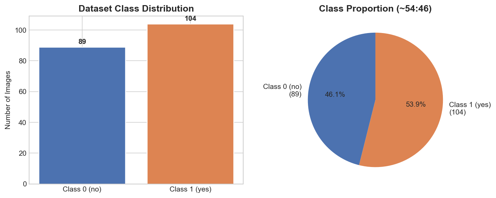
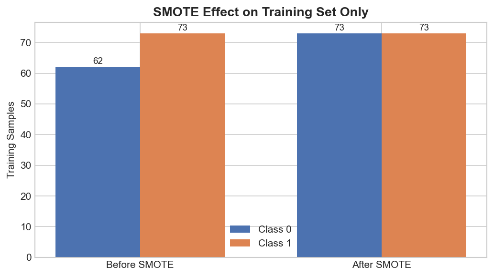
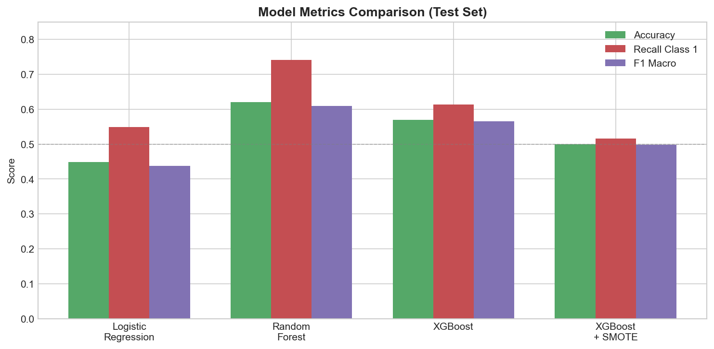
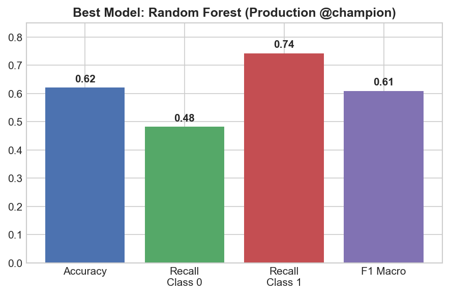

# Anomaly Detection with MLflow — Experiment Report

**Capstone Project — Machine Learning Experimentation Workflow**

| | |
|---|---|
| **Author** | [Your Name] |
| **Date** | June 2026 |
| **Dataset** | Local binary image dataset (`data/dataset/no/`, `data/dataset/yes/`) |
| **MLflow Experiment** | `anomaly-detection` |
| **Tracking URI** | http://127.0.0.1:5000 |

---

## 1. Executive Summary

This report summarizes four anomaly detection experiments tracked with MLflow. Models were trained on a local image dataset converted to numerical features, compared using accuracy, recall (both classes), and macro F1, and the best performer was promoted to production through the model registry.

**Key results:**
- **Best model:** Random Forest (62% accuracy, **74.2% anomaly recall**)
- **SMOTE impact:** Helped balance training data but **hurt XGBoost** test performance
- **Production:** Registered as `anomaly-detection-prod` @champion with verified test-set inference

---

## 2. Introduction

Anomaly detection on imbalanced data requires careful model choice, resampling strategy, and the right evaluation metrics. This capstone implements the full required workflow:

1. Load and inspect class distribution  
2. Stratified 70/30 train-test split  
3. SMOTE on training set only  
4. Four model experiments with MLflow tracking  
5. Model registry with @challenger and @champion aliases  
6. Production inference on held-out test data  

**Dataset source:** Local repository — images in `data/dataset/no/` (class 0) and `data/dataset/yes/` (class 1). Each image was converted to 32×32 grayscale → 1,024 pixel features.

---

## 3. Dataset and Preprocessing

### 3.1 Class Distribution

| Item | Value |
|------|-------|
| Total images | 193 |
| Class 0 (`no/`) | 89 |
| Class 1 (`yes/`) | 104 |
| Feature dimensions | 1,024 |
| Imbalance ratio | ~54% : 46% |



*Figure 1: Dataset class distribution — mildly imbalanced (~54:46)*

### 3.2 Train-Test Split

- **Method:** Stratified split, 70% train / 30% test, `random_state=42`
- **Training:** 135 samples
- **Test:** 58 samples (never used for training or SMOTE)

### 3.3 SMOTE (Training Only)

| Stage | Class 0 | Class 1 | Total |
|-------|---------|---------|-------|
| Before SMOTE | 62 | 73 | 135 |
| After SMOTE | 73 | 73 | 146 |



*Figure 2: SMOTE balanced the training set; test set remained untouched*

---

## 4. Experiment Results

### 4.1 Experiment 1 — Logistic Regression (Baseline)

| Parameter | Value |
|-----------|-------|
| C | 1 |
| solver | liblinear |
| used_smote | False |

| Metric | Value |
|--------|-------|
| Accuracy | 0.4483 |
| Recall (class 0) | 0.3333 |
| Recall (class 1) | 0.5484 |
| F1 (macro) | 0.4376 |

**Observation:** Weakest model. A linear classifier cannot capture complex pixel patterns in 1,024-dimensional space with only 135 training samples.

---

### 4.2 Experiment 2 — Random Forest

| Parameter | Value |
|-----------|-------|
| n_estimators | 30 |
| max_depth | 3 |
| used_smote | False |

| Metric | Value |
|--------|-------|
| Accuracy | 0.6207 |
| Recall (class 0) | 0.4815 |
| Recall (class 1) | **0.7419** |
| F1 (macro) | **0.6091** |

**Observation:** Best performer. Highest anomaly recall — most important metric when missing anomalies is costly.

---

### 4.3 Experiment 3 — XGBoost

| Parameter | Value |
|-----------|-------|
| eval_metric | logloss |
| used_smote | False |

| Metric | Value |
|--------|-------|
| Accuracy | 0.5690 |
| Recall (class 0) | 0.5185 |
| Recall (class 1) | 0.6129 |
| F1 (macro) | 0.5657 |

**Observation:** Second best. Outperformed Logistic Regression but did not match Random Forest.

---

### 4.4 Experiment 4 — XGBoost with SMOTE

| Parameter | Value |
|-----------|-------|
| eval_metric | logloss |
| used_smote | **True** |

| Metric | Value |
|--------|-------|
| Accuracy | 0.5000 |
| Recall (class 0) | 0.4815 |
| Recall (class 1) | 0.5161 |
| F1 (macro) | 0.4987 |

**Observation:** SMOTE **reduced** performance vs. XGBoost without SMOTE. On small high-dimensional data, synthetic samples may add noise rather than useful signal.

---

## 5. Metric Comparison

| Model | Accuracy | Recall C0 | Recall C1 | F1 Macro | SMOTE |
|-------|----------|-----------|-----------|----------|-------|
| **Random Forest** | **0.6207** | 0.4815 | **0.7419** | **0.6091** | No |
| XGBClassifier | 0.5690 | 0.5185 | 0.6129 | 0.5657 | No |
| Logistic Regression | 0.4483 | 0.3333 | 0.5484 | 0.4376 | No |
| XGBoost + SMOTE | 0.5000 | 0.4815 | 0.5161 | 0.4987 | Yes |



*Figure 3: Side-by-side metric comparison across all four experiments*



*Figure 4: Random Forest — production @champion metrics*

**Selection rule:** Highest `recall_class_1`, then `f1_score_macro` → **Random Forest**

---

## 6. Observations on Class Imbalance Handling

1. **Mild imbalance (~54:46)** — the main challenge was small sample size (193 images) and high dimensionality (1,024 features), not extreme class skew.

2. **SMOTE worked mechanically** — it balanced training from 62/73 to 73/73 per class, as required by the assignment.

3. **SMOTE did not improve generalization** — XGBoost + SMOTE scored worst among tree/boosting models. Oversampling synthetic pixel vectors on limited data likely caused overfitting.

4. **Random Forest without SMOTE won** — tree ensembles partition feature space effectively without needing balanced classes on this dataset.

5. **Recall-driven selection was appropriate** — optimizing for class 1 recall aligns with anomaly detection goals where false negatives are more costly than false positives.

---

## 7. MLflow Tracking and Model Registry

### Workflow completed

| Step | Status |
|------|--------|
| 4 runs in experiment `anomaly-detection` | Done |
| Params, metrics, artifacts logged | Done |
| Registered `anomaly-detector-xgb-smote` v1 | Done |
| Alias `@challenger` assigned | Done |
| Copied to `anomaly-detection-prod` v1 | Done |
| Alias `@champion` assigned | Done |
| Production inference on test set | Done |

### MLflow UI Screenshots

> Take these from http://127.0.0.1:5000 and save in `screenshots/`. Re-run `python reports/build_report_pdf.py` to embed them in the PDF.

#### Screenshot 1 — Experiments List View

*All four runs under experiment `anomaly-detection`*

#### Screenshot 2 — Runs Comparison View

*Compare accuracy, recall_class_0, recall_class_1, f1_score_macro*

#### Screenshot 3 — Best Run Detail (Random Forest)

*Parameters, metrics, and model artifact for Random Forest*

#### Screenshot 4 — Model Registry (@challenger)

*`anomaly-detector-xgb-smote` version 1 with @challenger*

#### Screenshot 5 — Production Model (@champion)

*`anomaly-detection-prod` version 1 with @champion*

---

## 8. Production Model Justification

**Selected model:** Random Forest → `anomaly-detection-prod` @champion

**Why Random Forest?**

| Criterion | Random Forest | Next best (XGBoost) |
|-----------|---------------|---------------------|
| Recall class 1 | **0.7419** | 0.6129 |
| F1 macro | **0.6091** | 0.5657 |
| Accuracy | **0.6207** | 0.5690 |

Random Forest catches **74% of anomalies** on the test set — 13 percentage points better than XGBoost. Production inference via `mlflow.pyfunc.load_model("models:/anomaly-detection-prod@champion")` reproduced identical metrics, confirming the registry pipeline works end-to-end.

**Production test classification report:**

```
              precision    recall  f1-score   support
           0       0.62      0.48      0.54        27
           1       0.62      0.74      0.68        31
    accuracy                           0.62        58
```

---

## 9. Conclusion

Four experiments were tracked, compared, and registered in MLflow. Random Forest was selected for production based on superior anomaly recall and macro F1. SMOTE was applied as required but did not improve the best boosting model — an important lesson that resampling must be validated empirically. The complete workflow — from data loading through production inference — is reproducible from the Jupyter notebook and documented in MLflow.

---

## 10. References

- Dataset: Local image dataset — `data/dataset/no/`, `data/dataset/yes/` (included in repository)
- MLflow Documentation: https://mlflow.org/docs/latest/
- imbalanced-learn (SMOTE): https://imbalanced-learn.org/
- Notebook: `notebooks/anomaly_detection_mlflow.ipynb`

---

## How to regenerate the PDF

```powershell
cd "Capstone Project"
.\venv\Scripts\Activate.ps1
python reports/generate_report_figures.py
python reports/build_report_pdf.py
```

Output: `reports/experiment_report.pdf`
